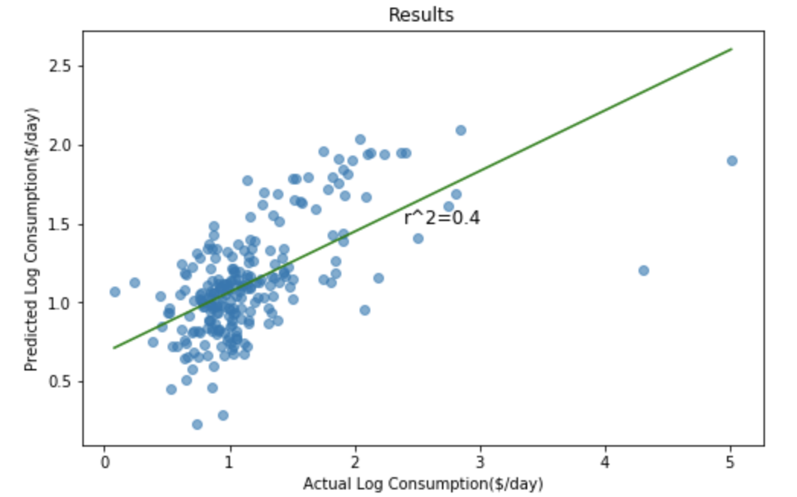
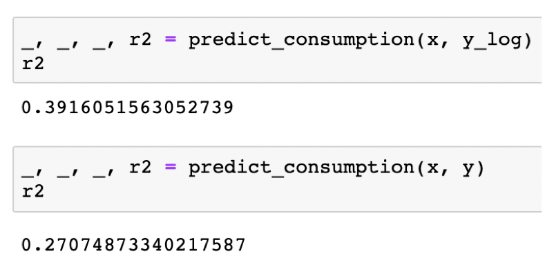

# predicting-poverty-replication
The purpose of this repository is to replicate the Jean et. al. (2016) paper (see `papers/jean_et_al.pdf` and `papers/aaai16.pdf`) using only Python3 and PyTorch. These more up-to-date tools and instructions should help anyone trying to recreate and build-off this work.

The purpose of the paper was to use abundant sources of data (namely satellite imagery and nightlights data) to predict poverty levels at a local level (on the order of a single village). For some background, every few years the World Bank conducts surveys in developing countries to understand their living situations. As you might expect, this process is very time-consuming. If we can make a model that only uses abundant sources of data to predict values that otherwise have to be measured through expensive human efforts, then several possibilities arise:
1) prediction during "off-years" (when no surveys are collected)
2) real-time monitoring of poverty conditions
3) potential for early-warning systems

Note 1: all scripts are put in Jupyter Notebook (.ipynb) files to encourage exploration and modification of the work. <br>
Note 2: I only work with data from Malawi

# Reproduction Results
<p align="inline" style='text-align:center'>
  
  
</p>

# Setup
I recommend creating a virtual environment for this project. I prefer using Anaconda.

First run:
```
git clone https://github.com/jmather625/predicting-poverty-replication
conda create -n <ENV_NAME> python=3.7 pip gdal
conda activate <ENV_NAME>
conda install pytorch torchvision -c pytorch
pip install -r requirements.txt
```
The libraries that are most likely to fail are gdal and geoio. If a requirement fails to install, first make sure you follow this install procedure exactly. Using `pip` to install GDAL did not work for me, and the only way I got it to install was by including it when I first make the conda environment (hence `pip gdal`). Also, there are several Stack Overflow posts on these issues, so hopefully one will work on your machine.

If you want to run Jupyter Notebooks in an environment, run the following inside the environment:
```
pip install --user ipykernel
python -m ipykernel install --user --name=<ENV_NAME>
```

Then, set the kernel for all the Jupyter files to whatever your <ENV_NAME> is.

# Downloading Data
There are several steps here, make sure to follow all of them.

1. Download the nightlights data by running the Jupyter file in `process_data/scripts/download_nightlights_data.ipynb`
2. Download the 2016-2017 Malawi survey data from https://microdata.worldbank.org/index.php/catalog. The World Bank wants to know how people use their data, so you will have to sign in and explain why you want their data. Query 'LSMS' and filter the years to help find the data. The title of the data when I downloaded it was `Fourth Integrated Household Survey 2016-2017`. If you look at the data description tab, you should see a huge list of files starting with `HH_Metadata`. Navigate to `Get Microdata` to download the data. Make sure to download the Stata version.
3. Unzip the downloaded Malawi data into `process_data/data/input/LSMS`, and rename the folder to `malawi_2016`.
4. Run the remaining scripts in `process_data/scripts` in the following order: <br>
    - `process_survey_data.ipynb` <br>
        This processes the survey data that you download in #2-3<br>
    - `get_image_download_locations.ipynb` <br>
        This takes the files created by #4b and generated the locations to download <br>
5. Get a Google static maps API key at https://developers.google.com/maps/documentation/maps-static/intro. Save it to `process_data/data/api_key.txt`. Couple points here: <br>
    - Downloading aerial imagery with a timestamp isn't free. The static maps API lets you query lat/long but not time. So, the images are likely from 2019 (current year) but we can't be sure. By using 2016 survey data, we are effectively trying to use 2019 images to predict their 2016 values. As a result, we may not get optimal results, but at least we can do this at no monetary cost and quick setup time. <br>
    - I did try using this same approach but with 2013 Malawi data, and the results were far worse. I think this indicates that the images are the problem, because using 2019 images to predict 2016 values should be easier than trying to predict 2013 values.
6. Navigate to `process_data/data` and run `downlod_mw_2016.ipynb`. It downloads satellite images of size 400x400 to `process_data/data/ims_malawi_2016`. This script takes several hours, as over 20k images are being downloaded. I hope to make all the images available on Dropbox or some hosting service to cut down the runtime, I just have to make sure I can do this with Google. <br>
    - `evaluate_download_progress.ipynb` can be used to see how many images have been downloaded. Note that if you are working on a VM like Google's Deep Learning VM, connections can close after extended periods of time. This doesn't stop the script itself from running, but there's no way to see the printed output anymore if you reopen the Jupyter file. This new file I made will simply read the number of images that are download. If the number keeps increasing, you know the script is still running. <br>
    - `im_download_demo.ipynb` demonstrates the API call in a standalone file.

# Use paper's model
This uses the original paper's weights on the images you downloaded.

I don't recommend doing this because you will need to setup Google's protocol buffers. This link may help:
https://github.com/protocolbuffers/protobuf/tree/master/python

1. Download weights from https://www.dropbox.com/s/4cmfgay9gm2fyj6/predicting_poverty_trained.caffemodel?dl=0 into `setup_existing_model`
2. Run `setup_existing_model/forward_pass.ipynb`
3. Run `use_existing_model.ipynb`


# Use my model
Download the model from https://drive.google.com/drive/folders/1gZZ1NoKaq43znWIBjzmrLuMQh4uzu9qn?usp=sharing and put it into the root directory. It should be named `trained_model.pt`. Then run `use_trained_model.ipynb`.


# Make model from scratch
This recreates the original paper's training procedure by downloading the VGG model weights and architecture and then applying the transfer learning task on binned nightlight values (nightlights range in value continuously from 0-63; the paper bins them into 3 categories for classification).

1. Run `process_data/create_data_folders.ipynb` to make the train and test sets. These should be in `process_data`
2. Run `train_model.ipynb`
3. Run `use_trained_model.ipynb`

For reasons I'm not entirely clear on, training the model from scratch (just 5 epochs!) performs better than using the existing model. In fact, I completely matched the paper's results. I would think that using 2019 images to predict 2013 nightlights, and then using the features to predict 2016 cluster values would have more error than using 2019 images with a pretrained model to predict 2016 cluster values. If anyone has any explanation I'd love to hear. I do know the paper authors didn't use images in the same year either (they had the same timestamped image problem), so perhaps it's the same error for both of us, which might also explain the similar results.


# Gold Standard
As a way to see how good the model is, I extract all features from the LSMS survey that an image could possibly recognize and use them to predict consumption. This serves as a "gold standard" for any image-based model. It turns out that the CNN model performs almost as well as this gold standard!

1. Run `gold_standard/remote_features_survey_model.ipynb`


# Activation Maps
Activation maps are a good way to visually depict what a CNN focuses on.

1. Run `activation_maps/visualize_cnn.ipynb`

Big thanks to https://github.com/utkuozbulak/pytorch-cnn-visualizations for making CNN visualizations easier. I borrowed one technique, feel free to try more. Here are two examples:
<p align='center'>
  
  
</p>

<p align='center'>
    
    
</p>

Because the number of images far exceeds how many I can feasibly hand-check, it is difficult to make generalizations about what the model focuses on. That being said, roads tend to be a key area of focus, and bodies of water tend to be identified. Urban development/housing also seem to be important to the model, but activation maps outline them less clearly and distinctly than roads.

However, the model does not seem to be especially robust. The image below was downloaded via my script and appears to be during nighttime, therefore hold little visual information. Nevertheless, the activation maps are still bright with meaningless information.


<p align='center'>
    
    
</p>


# High Level Procedure Overview
This section is meant to explain at a high level the procedure that the paper follows.

1. Download LSMS data. This data tells us a lot of low-level information about developing countries. This includes consumption, which is the variable we try to predict. Consumption is the dollars spent on food per day. $1.90 is the global poverty line.
2. Download nightlights data. This data is hosted by the NOAA and can be downloaded for free. I use a geo-raster library to convert an input lat/long into pixel locations onto the array that is downloaded.
3. Generate cluster aggregates for information. A cluster is defined as a 10km^2 region enclosing a given central lat/long (which itself comes from the LSMS data). This means we aggregate values like consumption and nightlights across various lat/longs in a cluster.
4. Transfer learn train VGG on the images to predict the nightlight bins.
5. Compute the 4096 size feature vector (right before it is condensed into classification) for each image. Average these across a cluster.
6. Assemble a dataset of clusters where you try to predict consumption (rather log consumption) from the aggregate feature vector per cluster. Use Ridge Regression.


# Contact
You can reach me via email at jatinm2@illinois.edu


