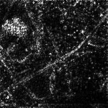
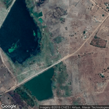
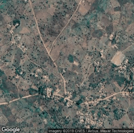
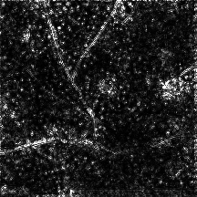
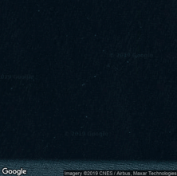
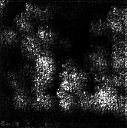

# predicting-poverty-replication

The purpose of this repository is to replicate the Jean et. al. (2016) paper (see `papers/jean_et_al.pdf` and `papers/aaai16.pdf`) using only Python3 and PyTorch. These more up-to-date tools and instructions should help anyone trying to recreate and build-off this work.

The purpose of the paper was to use abundant sources of data (namely satellite imagery and nightlights data) to predict poverty levels at a local level (on the order of a single village). For some background, every few years the World Bank conducts surveys in developing countries to understand their living situations. As you might expect, this process is very time-consuming. If we can make a model that only uses abundant sources of data to predict values that otherwise have to be measured through expensive human efforts, then several possibilities arise:

1. prediction during "off-years" (when no surveys are collected)
2. real-time monitoring of poverty conditions
3. potential for early-warning systems

Note 1: all scripts are put in Jupyter Notebook (.ipynb) files to encourage exploration and modification of the work. <br>
Note 2: I chose to work with Malawi, Ethiopia, and Nigeria as they had the most usable data in 2015-2016

# Reproduction Results

For a direct comparison with the original paper, refer to the table below:

| Country | Their Year | Their R<sup>2</sup> | Our Year | Our R<sup>2</sup> |
| ------- | ---------- | ------------------- | -------- | ----------------- |
| Malawi  | 2013       | 0.37                | 2016     | 0.41              |
| Nigeria | 2013       | 0.42                | 2015     | 0.34              |

There are a few differences between this reproduction and the original paper that are summarized in my answer [here](https://github.com/jmather625/predicting-poverty-replication/issues/5#issuecomment-652178777). Also, I added Ethiopia to this repository to show that the method does not work in all countries. Ethiopia was not included in the original paper.

# Setup

I recommend creating a virtual environment for this project. I prefer using Anaconda.

First run:

```
git clone https://github.com/jmather625/predicting-poverty-replication
conda create -n <ENV_NAME> python=3.7 pip gdal
conda activate <ENV_NAME>
conda install pytorch==1.3.0 torchvision==0.4.1 -c pytorch
pip install -r requirements.txt
```

The libraries that are most likely to fail are gdal and geoio. If a requirement fails to install, first make sure you follow this install procedure exactly. Using `pip` to install GDAL did not work for me, and the only way I got it to install was by including it when I first make the conda environment (hence `pip gdal`). There are also several Stack Overflow posts on these issues, so hopefully one will work on your machine. Regarding machines, I'd highly recommend getting a deep learning VM or some other CUDA-enabled runtime environment. The operating system should preferably be Linux. If not, you may run into some issues creating the symlinks.

If you want to run Jupyter Notebooks in an environment, run the following inside the environment:

```
pip install --user ipykernel
python -m ipykernel install --user --name=<ENV_NAME>
```

Then, set the kernel for all the Jupyter files to whatever your ENV_NAME is.

To allow tqdm (the progress bar library) to run in a Jupyter Notebook, also run:

```
conda install -c conda-forge ipywidgets
```

To get the data, you need to do three things:

1. download nightlights data from https://www.ngdc.noaa.gov/eog/viirs/download_dnb_composites.html. Use the 2015 annual composite in the 75N/060W tile and the 00N/060W tile. Choose the .tif file that has "vcm-orm-ntl" in the name. Save them to `viirs_2015_<tile_descriptor>.tif`, where tile_descriptor is 75N/060W or 00N/060W. As of December 2, 2020, these seemed to have been archived. I've uploaded a copy here: https://drive.google.com/drive/folders/1gZZ1NoKaq43znWIBjzmrLuMQh4uzu9qn?usp=sharing.
2. get the LSMS survey data from the world bank. Download the 2016-2017 Malawi survey data, 2015-2016 Ethiopia data, and the 2015-2016 Nigeria data from https://microdata.worldbank.org/index.php/catalog/lsms. The World Bank wants to know how people use their data, so you will have to sign in and explain why you want their data. Make sure to download the CSV version. Unzip the downloaded data into `countries/<country name>/LSMS/`. Country name should be either `malawi_2016`, `ethiopia_2015`, or `nigeria_2015`.
3. get an api key from either Planet or Google's Static Maps API service. Both of these should be free, but Planet may take some time to approve and require you to list a research project to be eligible for the free tier. Google's service should be free if you download under 100k per month. Save the api keys to `planet_api_key.txt` or `google_api_key.txt` in the root directory. I used Planet's API because then I could download images from 2015 and 2016, whereas Google's service only offers recent images over the last year. The code will show how to get the images from either API.

# Scripts

Run the Jupyter files in the following order:

```
scripts/process_survey_data.ipynb
scripts/download_images.ipynb
scripts/train_cnn.ipynb
scripts/feature_extract.ipynb
scripts/predict_consumption.ipynb
```

In the code itself you should see some comments and lines explaining ever step. Couple points:

- the image download step will take the longest amount of time (several thousand per hour).
- if you are working on a VM like Google's Deep Learning VM, connections can close after extended periods of time. This doesn't stop the script itself from running, but there's no way to see the progress bar in the notebook.
- training the CNN on CPU is something you should try to avoid. Training the CNN took just a few hours on a single GPU, and a forward pass to extract features took just a few minutes. On CPU, those runtimes are at least an order of magnitude higher.

Besides training the CNN from scratch, you can also do one of the following:

## Using the original paper's model

I don't recommend doing this because you will need to setup Google's protocol buffers. This link may help:
https://github.com/protocolbuffers/protobuf/tree/master/python. First, download weights from https://www.dropbox.com/s/4cmfgay9gm2fyj6/predicting_poverty_trained.caffemodel?dl=0 into `scripts/setup_existing_model/`. Then, run the script in `scripts/setup_existing_model/forward_pass.ipynb`. Finally, run `scripts/predict_consumption.ipynb.`

## Use my model

Download the model I trained from https://drive.google.com/drive/folders/1gZZ1NoKaq43znWIBjzmrLuMQh4uzu9qn?usp=sharing and put it into the `models` directory. It should be named `trained_model.pt`. Then run `scripts/predict_consumption.ipynb`.

# Gold Standard

As a way to see how good the model is, I extract all features from the LSMS survey that an image could possibly recognize and use them to predict consumption. This serves as a "gold standard" for any image-based model.

1. Run `gold_standard/remote_features_survey_model.ipynb`

# Activation Maps

Activation maps are a good way to visually depict what a CNN focuses on.

1. Run `activation_maps/visualize_cnn.ipynb`

Big thanks to https://github.com/utkuozbulak/pytorch-cnn-visualizations for making CNN visualizations easier. I borrowed one technique, feel free to try more. Here are two examples:

<p align='center'>
  
  
</p>

<p align='center'>
    
    
</p>

Because the number of images far exceeds how many I can feasibly hand-check, it is difficult to make generalizations about what the model focuses on. That being said, roads tend to be a key area of focus, and the edges of bodies of water tend to be identified.

However, edge cases seem to present weird outcomes. The image below was downloaded via my script and appears to be faulty. The activations are dimmed, but still present near the border of the image.

<p align='center'>
    
    
</p>

# High Level Procedure Overview

This section is meant to explain at a high level the procedure that the paper follows.

1. Download LSMS data. This data tells us a lot of low-level information about developing countries. This includes consumption, which is the variable we try to predict. Consumption is the dollars spent on food per day. $1.90 is the global poverty line.
2. Download nightlights data. This data is hosted by the NOAA and can be downloaded for free. I use a geo-raster library to convert an input lat/long into pixel locations onto the array that is downloaded.
3. Generate cluster aggregates for information. A cluster is defined as a 10km x 10km region enclosing a given central lat/long (which itself comes from the LSMS data). This means we aggregate values like consumption and nightlights across various lat/longs in a cluster.
4. Transfer learn train VGG on the images to predict the nightlight bins.
5. Compute the 4096 size feature vector (right before it is condensed into classification) for each image. Average these across a cluster.
6. Assemble a dataset of clusters where you try to predict consumption (rather log consumption) from the aggregate feature vector per cluster. Use Ridge Regression.

# Contact

You can reach me via email at jatinm2@illinois.edu
